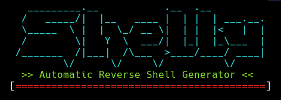

<p align="center"><a href="https://www.itsecurity.id/"></a></p>

<p align="center"><a href="https://www.itsecurity.id/"></a></p>

---

- <kbd>Download / Install</kbd>

```cmd
root@kali:~# wget -q "https://raw.githubusercontent.com/Xcod3bughunt3r/Shelly/main/shelly.sh" -O /usr/bin/shelly
root@kali:~# chmod +x /usr/bin/shelly
```

- <kbd>Use</kbd>

```cmd
root@kali:~# shelly -h <LHOST> -p <LPORT> -l <LANGUAGE>
```

- <kbd>Available Languages</kbd>

  * Bash
  * Netcat
  * PHP
  * Ncat
  * Python
  * Python3
  * Perl
  * Telnet
  * PowerShell
  * Awk
  * Socat
  * Ruby
  * Xterm
  * Gawk

---

#### ``PLEASE CHECK`` *[LICENSE](LICENSE)*
#### ``DEVELOPERS:``*[Xcod3bughunt3r](https://github.com/Xcod3bughunt3r/Xcod3bughunt3r)*
